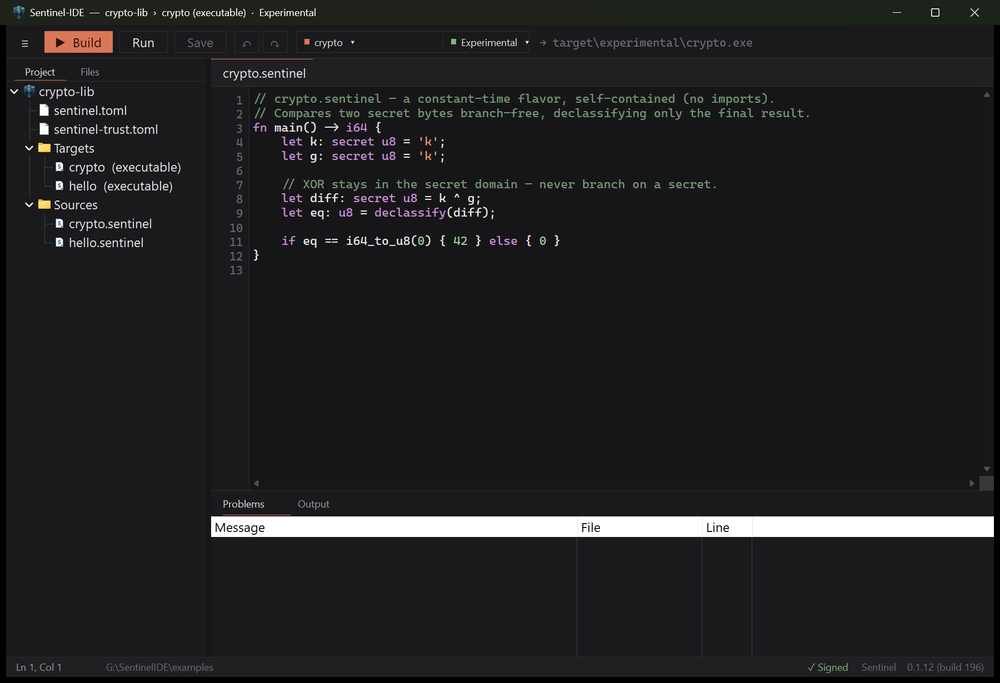

# Sentinel-IDE

A native, **Windows-first IDE for the Sentinel language** — built, increasingly, *in* Sentinel. The long-term thesis: a thin native host that shrinks over time as more of the IDE is rewritten in Sentinel itself.

> **Status: released and self-updating, still early.** Twelve public releases (`v0.1.0` … `v0.1.12`), each an Ed25519-signed installer that existing installs auto-update to. It is genuinely used to edit Sentinel code — but it is Windows-only, needs a local `snc` (the Sentinel compiler) to build Sentinel code, and the build script has machine-specific paths. Early, not a toy.



*The Direct2D editor with Sentinel syntax colouring, the project tree over a multi-target manifest, the target/tier scheme selector, and the trust chip reporting a verified signature.*

## What it does today

- **Themed dark/coral shell** (DWM dark titlebar, dark popup/context menus) with a dark TreeView + a **Direct2D/DirectWrite code editor** and **Sentinel syntax highlighting** (RichEdit is now only the Output pane).
- **Editor**: a Direct2D/DirectWrite control — no word wrap, real horizontal scrolling, syntax colouring painted rather than stored (so it cannot reach the undo stack at all), line-number gutter, dirty `●`/Save, error-line tints, **undo/redo**, drag-and-drop of text, and clickable `file:line:col` links in build output.
- **Build / Run** via `snc` on a worker thread — streamed Output + a clickable Problems list. Builds link and run (the IDE injects the auto-detected MSVC environment so `link.exe` works).
- **Project model**: a `*.sntproject` (or legacy `sentinel.toml`) manifest with **multiple `[[target]]`s**, an Xcode-style **target ▾ · tier ▾** scheme selector, a structured **Project Settings** form with per-target editing, **New / Open / Close Project**, **Recent Projects**, and **New File**.
- **Signing & Trust (ADR-0061)**: real `snc keygen`/`sign`/`verify` with a live status-bar trust chip; a successful build can sign the produced artifact.
- **Sealed projects**: encrypt a project so only the holder of the password can open it — archive → LZMS-compress → AES-256-GCM under a random key, with **LUKS-style unlock slots** (PBKDF2 password slot today; key-file / smartcard / TPM slots can be added without re-encrypting — the container binds only its fixed header as AEAD associated data, precisely so the slot table stays mutable). See [`src/core/Seal.h`](src/core/Seal.h) and its tests in [`tests/seal_test.cpp`](tests/seal_test.cpp).
- **File associations**: register `.sntproject` / `.sentinel` so a double-click opens the IDE.
- **Auto-update** via [WinSparkle](https://winsparkle.org/): checks an **Ed25519-signed appcast** and installs the signed installer, so a release reaches existing users without a manual download. **Live** — a real install has updated itself across five releases in one step. **Check for Updates…** asks before it installs, and says so when you are already current or the check failed. See [`docs/RELEASING.md`](docs/RELEASING.md).
- **About box** shows **lines-of-code badges** whose total is **counted by [`tools/loc.sentinel`](tools/loc.sentinel)** — the first piece of the IDE written in Sentinel.

## Built in Sentinel (the dogfood)

[`tools/loc.sentinel`](tools/loc.sentinel) is a real Sentinel program in the build pipeline: it reads the concatenated source corpus and counts the lines that the About box's "Total" badge displays. The **sealing crypto core** (`Seal.h`'s AEAD + KDF) is the next planned rewrite target — Sentinel's `std/security` already has a machine-verified constant-time ChaCha20-Poly1305 + SHA-256, and the `.sealed` format reserves algorithm ids for it.

## Building

Requires **Windows + Visual Studio 2026** (MSVC + the bundled CMake/Ninja) and, to build/run Sentinel code, a local checkout of the Sentinel language with a `snc` compiler.

```
scripts\build.bat            :: configures + builds → build\Sentinel-IDE.exe
```

- The VS install path is hard-coded near the top of `scripts\build.bat` — adjust it if VS lives elsewhere.
- The IDE auto-detects `snc` and the MSVC environment; both are overridable in **Settings**.
- The build number is derived from the **git commit count**, so the same commit always stamps the same version and any released build can be rebuilt; the marketing version lives in `MKT`/`MKTRC` at the top of that script.

### Installer

`packaging/Sentinel-IDE.iss` is an [Inno Setup](https://jrsoftware.org/isinfo.php) script that produces a per-user `setup.exe` (Start-Menu shortcut, `.sntproject`/`.sentinel` file associations, uninstall). With Inno Setup 6 installed (`winget install JRSoftware.InnoSetup`):

```
scripts\make-installer.bat   :: → build\installer\Sentinel-IDE-<version>-setup.exe
```

## Tests

```
ctest --test-dir build       :: 11 tests
```

Worth knowing what they actually pin, because several were written after something
shipped broken. `editor_model` round-trips the **committed signed** `examples/crypto.sentinel`
byte-for-byte — the editor auto-saves that file on Build, so a CRLF slip would invalidate its
signature with nobody pressing Ctrl+S. `d2d_render` renders the editor offscreen through WIC and
asserts on real pixels, including that the colouring is not monochrome. `d2d_dialect` pins the
message dialect, that change notifications are **synchronous** (a `PostMessage` regression there
would silently discard a buffer), the accelerator routing that keeps undo alive, and the DPI
rescale the line-number gutter depends on. The `*_parity` tests cross-check each Sentinel parser
against its retired C++ original.

Note the test targets are `EXCLUDE_FROM_ALL`, so `scripts\build.bat` does **not** rebuild them —
build them explicitly or `ctest` runs against stale binaries.

## Layout

| Path | What |
|---|---|
| `src/host/win32/MainWindow.cpp` | The app (window, toolbar, tree, dock, build/run, project) |
| `src/host/win32/D2DEditor.{h,cpp}` | The Direct2D/DirectWrite editor control |
| `src/editor/EditorModel.{h,cpp}` | The pure text model — buffer, caret, selection, undo; no Windows |
| `src/editor/SyntaxLexer.{h,cpp}` | The Sentinel lexer behind the colouring |
| `src/host/win32/*Dialog.{h,cpp}` | Themed modal dialogs (Settings, Project Settings, Signing, About, Password) |
| `src/host/win32/Theme.h` | Dark/coral palette + dark-mode helpers |
| `src/core/*.h` | Project model, signing, sealing, toolchain detection, settings, logging |
| `tools/loc.sentinel` | Lines-of-code counter, written in Sentinel |
| `examples/` | A sample Sentinel project (signed demo) |
| `docs/` | Handover + design notes + screenshots |

## License

**GPL-3.0-or-later** (see [`LICENSE`](LICENSE)). The Win32 shell/theme is modeled on, and partly derived from, the GPL-3.0 **SQLTerminal-Win32**.
